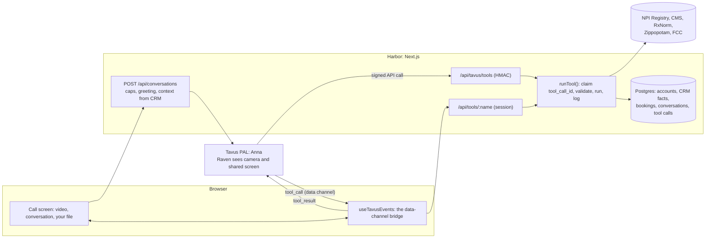

# Harbor: a Medicare sales rep that does the work

Anna is a face-to-face sales rep for a (fictional) Medicare brokerage, built on Tavus CVI. While she talks
with you she **looks up your real doctor** in the national clinician registry, **checks your real
medications** in the national drug database (or **reads them off your shared screen**), compares plans from
a Postgres catalog, **books you with a licensed advisor**, and keeps it all in your account so the next call
picks up where this one stopped. She never picks a plan for you or enrolls you; a licensed human does that.

**Live:** https://harbor-umber.vercel.app (Vercel + Neon). Sign-up asks for an invite code, because every call
spends Tavus minutes; the code comes with this link.

## Why this, for a Tavus customer

**The buyer is a Medicare insurance brokerage, and the moment is now.** Medicare's Annual Enrollment
Period opens **October 15**. Brokers staff up for it (SelectQuote hires about 2,000 seasonal agents and
books roughly 70% of its senior new-policy sales in the October–March enrollment windows), and licensed
agent time is the bottleneck. Each new Medicare Advantage enrollment pays the broker up to **$694 in its
first year** (2026 CMS cap, most states). An agent that does the first conversation well, at 3 a.m., in
four minutes, is worth real money.

**It's where Tavus already sells.** AI sales reps are Tavus's lead use case (Qualified's Piper: 6× more
meetings booked), and health insurance is a live vertical (Chappy.ai runs insurance sign-up on Tavus;
Tavus's own `gohealth-demo` is a create-and-join starting point). This is the version a Customer Engineer
would build for that account: tools that touch real systems, compliance, and a handoff.

**It needs video, specifically.** The callers are 64 and older. Spelling "apixaban" out loud is hard;
**showing it is easy**: share your pharmacy's prescription list (or hold up the bottle) and Anna reads it
through Tavus's perception model, then checks each drug. A patient face, captions and slow turn-taking do
the rest. And the rules are concrete enough to engineer against: CMS requires third-party marketers to say a
specific disclaimer **within the first minute** of a sales call.

## What happens

1. **Sign up** with name, email, ZIP and a password. The ZIP becomes a county, because plans depend on it.
2. **Home** offers a call, or a starting question ("Is my doctor covered?"). The pick becomes the call's topic.
3. **Camera check first.** The Tavus conversation is created only when you press Join, because Tavus bills
   from creation.
4. Anna opens with the AI disclosure, the CMS disclaimer and a transcription notice, spoken word for word.
5. "I take Eliquis, my doctor is Dr. Patel." While she says "let me check", the lookups run. The chat shows
   each one live ("Checking Eliquis…", then what she found; expand it for the tool, arguments, sources and
   time), and a **canvas** slides over the stage, Anna moving to a thumbnail like a presenter. Its left menu
   follows the steps of a Medicare check: **Overview** (progress and a grid of every plan against your doctor
   and each drug), **Doctors**, **Medications**, **Plans**, **Licensed advisor**, plus **Medicare basics**
   (HMO vs PPO, premiums vs deductibles, who the insurance company is, in plain English).
6. Choices are buttons: which doctor, which strength, a plan's details, an open time. Tapping one answers Anna.
   Or press **Share screen** and show her a prescription list; she reads it back, you confirm, she checks each.
   Or paste one message asking for everything, and she runs every check back to back.
7. "Which plan should I pick?" She won't. She offers a licensed advisor and books the time you confirm.
8. The call lands in the **sidebar** as a record, like meeting notes: a summary (next step, progress, coverage
   grid, compliance checklist), the transcript, and every result grouped by step. **Your coverage** gathers
   everything verified across calls.
9. Next call: "Welcome back, Bob." Anna starts from what's on file and asks what changed.
10. Licensed advisors (`ADVISOR_EMAILS`) get an **advisor console**: everyone Anna spoke with, by deal stage.
    Admins (`ADMIN_EMAILS`) get **Admin**: every conversation's agent trace and the eval suite.

## How it works



### The agent loop (one turn)

```
caller speaks / types / taps an option
   │
1. HEAR      Tavus STT; Sparrow-2 decides when the caller has finished
2. SEE       Raven adds what's on camera or the shared screen
3. CONTEXT   system prompt + this call's context (location, date, topic, verified CRM facts)
             + Tavus memory + Knowledge Base passages + objectives + history
4. DECIDE    the LLM answers, or calls tools (often several at once)
   └─ tool call(s): Anna says a filler ("let me check…") while…
5. ACT       …our server runs runTool(): validate args against agent/tools.json → claim the
             tool_call_id (retries replay) → run (NPI · CMS · RxNorm · Postgres) → [trace] + ledger.
             Reads arrive via the browser (which opens the canvas); writes come signed from Tavus.
6. OBSERVE   tool_result goes back to the LLM → back to 4 (it may chain: drug → plans → cost)
7. SPEAK     TTS + face video; words stream into the transcript
   ‖ guardrails and objectives are evaluated on every turn
```

Tavus owns the loop (1–4, 6, 7). We own step 5 and the data: actions are deterministic and
auditable; the model decides and narrates. Around it: each call ends in a record with the agent
trace; verified facts and Tavus memory start the next call; and the dev loop is edit `agent/` →
`npm run agent:sync` → run the evals → read the trace → fix.

### The agent is configuration, in this repo

`agent/` is the source of truth. Nothing is clicked together in Tavus's web UI.

| File | What it defines |
|---|---|
| `agent/pal.json` | Face, LLM, turn-taking, perception (including "is the caller showing a prescription list?"), speech hints |
| `agent/system-prompt.md` | Who Anna is, the order of the conversation, reading a shared screen, the line she never crosses, tool rules |
| `agent/tools.json` | Every tool's schema, description, delivery and `on_call` / `on_resolve`. The server validates arguments against the **same** JSON, so the contract can't drift |
| `agent/objectives.json` | The milestones a call must reach: consent, doctors and medications, a next step. Questions a caller may skip stay in the prompt (Tavus re-asks an active objective every turn) |
| `agent/guardrails.json` | No plan recommendations, not Medicare, no enrollment or sensitive data, no medical advice |

`npm run agent:sync` reconciles these with Tavus idempotently (upsert by name, attach, prune strays; objectives
are recreated only when their content changes). `npm run agent:check` prints the plan without changing anything.

### Why each Tavus feature, and why that way

| Feature | How it's used | Why |
|---|---|---|
| Tools, app-message delivery | Doctor, drug, plan, cost and calendar lookups | The browser renders the card in the same instant Anna gets the answer |
| Tools, API delivery + HMAC | Booking, saving a preference | Writes must be authenticated, idempotent and survive a closed tab; the browser can never trigger one |
| `on_resolve: generate_response` on every tool | | The default, `fire_and_forget`, makes the rep ignore the result. A test enforces this |
| `custom_greeting` | AI disclosure, CMS disclaimer, transcription notice | Spoken verbatim and can't be interrupted, so compliance-critical words don't depend on the model |
| Raven perception + screen share | Reading prescription lists and bottles; spotting a third party answering for the caller | Showing beats spelling for a 70-year-old; and a family member answering is a real compliance issue |
| `conversational_context` | Location, today's date, the chosen topic, and what earlier calls verified | Memory comes from the CRM, the one place facts are verified, so Anna never "remembers" something unchecked |
| Objectives, guardrails | Three milestones; four compliance rules | They steer the model; the hard guarantees are in code |
| `conversation.respond` | Typing to Anna, tapping an option on the canvas | Some callers can't or won't say it out loud |
| Knowledge Base | Five Medicare.gov documents (incl. the *Medicare & You 2026* handbook), attached by tag, `balanced` retrieval | General questions answered from official text. Never used for our plans' prices or networks: those come only from tools |
| Memories | `participant_tags` per caller (our contact id, never the email) | Tavus learns softer context across calls; verified facts still come from the CRM |
| Text-only chat mode | The eval suite: real PAL, real tools, no video | The same mechanism Tavus's own CLI and evals use |

### Design decisions worth defending

- **Code owns every fact.** Coverage, network, prices and appointment times come from deterministic functions;
  the model narrates them. Tool results carry a small `speak` payload for Anna (well under Tavus's 4 KB
  app-message cap) and a richer `card` for the screen.
- **Idempotent by `tool_call_id`.** `runTool()` claims the id before running anything (set-if-not-exists), so a
  retry or a duplicate delivery gets the stored result instead of a second booking. Reusing an id for a
  different tool is rejected rather than answered with another tool's result.
- **The model never computes dates.** Availability returns slots whose id *is* the UTC start time; the server
  re-validates any slot handed back.
- **Memory is the CRM.** Each call's context carries what earlier calls verified (doctors, drugs, booking,
  preferences). One ledger, nothing to sync, and a returning caller is never re-asked.
- **Slow upstreams don't become dead air.** Every public API call has a hard timeout and a cache, and failures
  become something Anna can say. CMS's `query` endpoint took 8–13 s per doctor; its SQL endpoint takes 0.7–3 s.
- **Billing-aware.** Created on Join, capped at 270 s (inside the free tier's 5 minutes), ended on End, on tab
  close (beacon), when Anna hangs up, or at the cap. Calls are capped per account per hour and per day, sign-up
  can require an invite code, and Tavus's single-stream limit shows as "Anna is with another caller".

## Testing, tracing and evals

- **Deterministic layer:** Vitest (tools against recorded real API responses, idempotency, HMAC, compliance
  wording, call state, eval scoring) and a Playwright end-to-end test from sign-up to the camera check.
- **Agent trace:** every tool call logs a `[trace]` line (tool, arguments, status, latency, exactly what Anna was
  told) and is stored; each call's record shows it next to Tavus's own transcript of the calls its model made, so
  a call that never reached us stands out. Live traces caught real bugs: the model fired every tool at once (plan
  tools now wait for drug and doctor lookups still running on the same call) and put a first name in the
  specialty field (clearer tool description, plus a server-side recovery).
- **Evals:** `evals/cases.json` runs on the admin Evals page against the live PAL in Tavus's text-only chat mode,
  with real tools: right tools, right arguments, and what Anna must and must never say (no plan recommendation,
  never repeating a Medicare number, Knowledge Base answers). Booking is a server tool Tavus calls directly, so
  the runner reads it from our tool-call ledger. One case is the walkthrough demo end to end, as a San Francisco
  caller. Latest run: [`evals/REPORT.md`](evals/REPORT.md). The evals caught real bugs: an active Tavus objective
  is pushed every turn, so Anna asked "are you turning 65?" in nearly every reply (optional questions moved to
  the prompt); the model dropped a doctor's first name (now a required field); and "today" after hours jumped to
  next week's slots (now falls back to the soonest times).

## Production details

- **Accounts:** email and password, hashed with scrypt; a stateless HMAC-signed session cookie (`httpOnly`,
  30 days). The whole mechanism is `lib/auth.ts`. Every page, server action and route resolves the user there
  and only reads that person's rows; the browser can only run lookups for its own call.
- **Server tools:** verify `X-Tavus-Signature` against the raw body with a timing-safe compare; the secret is
  mandatory; writes only for active conversations this server created. The API key never reaches the browser.
- **Observability:** every tool call is stored with arguments, status, latency and result; each call's record
  page rebuilds "what Anna checked" from that ledger, not from what the model said.
- **Data:** Postgres (Neon) in production; embedded PGlite locally and in tests, so `npm run dev` needs no
  database. The schema is applied idempotently on first query.

## Run it

```bash
npm install
cp .env.example .env.local   # set SESSION_SECRET (and TAVUS_API_KEY for calls)
npm run dev                  # http://localhost:3000
npm test                     # unit tests, offline (recorded fixtures for the public APIs)
npm run test:e2e             # sign-up to camera check in a real browser (stop `npm run dev` first)
```

For calls, set `TAVUS_API_KEY`, then:

```bash
npm run agent:sync     # creates the PAL, tools, objectives and guardrails; prints TAVUS_PAL_ID
npm run verify         # readiness check, including a free test_mode conversation
```

Booking and saved preferences are server tools, so Tavus needs a public HTTPS URL: deploy (Vercel + Neon), set
`APP_BASE_URL`, `TAVUS_TOOL_SECRET`, `TAVUS_PAL_ID`, `SESSION_SECRET`, `DATABASE_URL` (and `INVITE_CODE`,
`ADVISOR_EMAILS`, `ADMIN_EMAILS`), then run `npm run agent:sync` again.

## What I deliberately didn't build

- **Choosing or enrolling a plan.** That requires a license; the agent stops at a booked handoff. A real
  brokerage's compliance team would review exactly where that line sits.
- **Real plan, network and formulary data.** Plans and prices are demo data, labelled on every card. Doctor and
  drug *identities* are real; network membership is simulated deterministically and never claimed about a real
  doctor's contracts. Production would load the carriers' formulary and network files.
- **Evals in CI.** Each eval case is a short billed Tavus conversation, so the suite runs on demand from the admin
  page rather than on every commit.
- **Email, password reset, webhooks, an ops dashboard.** Each is a real product need and none changes what this
  demo proves. I cut them to keep the code small enough to read in one sitting.

Extending it: see [`AGENTS.md`](AGENTS.md).
